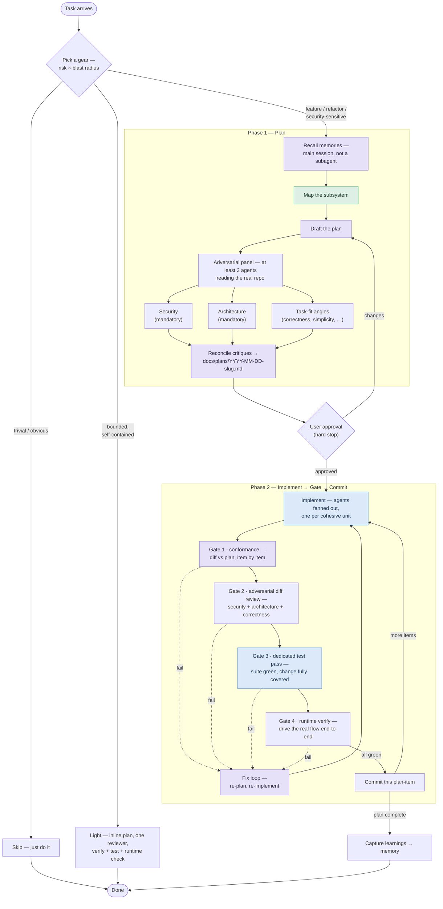

# claude-workflow

[](https://github.com/JulesNsenda/claude-workflow/actions/workflows/ci.yml)

My global [Claude Code](https://claude.com/claude-code) configuration — a small,
curated set of working preferences and skills that I symlink into `~/.claude`.

It's public because the core of it is a **plan-then-implement workflow** and a
**model-routing convention** that I think are good defaults for agentic coding.
Copy what's useful.

## What's in here

| File | What it is |
|---|---|
| [`CLAUDE.md`](./CLAUDE.md) | Always-on rules Claude Code loads every session: the model-tier table, the three gears, and the hard rules. Deliberately small — the procedure lives in the skill below. |
| [`skills/`](./skills/) | On-demand [skills](https://docs.claude.com/en/docs/claude-code/skills). [`plan-gates`](./skills/plan-gates/SKILL.md) is the full plan → gate → commit procedure; [`test`](./skills/test/SKILL.md) enforces the "test everything" pass; [`example-skill`](./skills/example-skill/SKILL.md) is a documented template. |
| [`agents/`](./agents/) | [Subagents](https://docs.claude.com/en/docs/claude-code/sub-agents): the adversarial [`security-critic`](./agents/security-critic.md) and [`architecture-critic`](./agents/architecture-critic.md) (read-oriented tools, findings-only output), an [`implementer`](./agents/implementer.md) that builds strictly from the approved plan (no web/research tools), a [`test-runner`](./agents/test-runner.md) specialist, and an [`Explore`](./agents/explore.md) override pinned to the fast tier. (If your Claude Code version doesn't let a user agent shadow the built-in name, note that the usual workaround — `CLAUDE_CODE_SUBAGENT_MODEL` — is **not** an Explore-only lever: it outranks every subagent's `model:` frontmatter, so it would silently drop the two `opus`-pinned critics onto the fast tier too. Prefer the override file.) |
| [`settings.json`](./settings.json) | Mostly permission hygiene: blocks the **Read tool** from secret paths (`.env*`, `secrets/`, `*.pem`/`*.key`, `~/.ssh`, `~/.aws`), denies the common force-push forms, asks before **every** push, allow-lists routine git commands. Plus one advisory behavioural default — `workflowSizeGuideline: small`, which asks Claude to aim under 5 agents in any *dynamic workflow* it writes. That is a different mechanism from this repo's own subagents, which it does not touch — and it is advice, not a cap. Setting it from a settings file needs ≥ 2.1.219 (`/config` has offered it since 2.1.202). If you merge this file by hand, merge the `permissions` block first and independently: it is the part that is load-bearing. And note the direction the installer's symlink runs — once linked, upstream changes to this file land in your live config on `git pull`, so `cp -L` it to a real file if you want to gate that. |
| [`.claude-plugin/`](./.claude-plugin/plugin.json) | Plugin manifest, so the skills + agents can also be installed as a namespaced [plugin](https://docs.claude.com/en/docs/claude-code/plugins). |
| [`scripts/`](./scripts/) | The leak guard and [`run-stats.sh`](./scripts/run-stats.sh), the run-stats aggregator. **Not** symlinked by the installer — run these from the clone. |
| [`install.sh`](./install.sh) / [`install.ps1`](./install.ps1) | Symlink the above into `~/.claude`. Idempotent; backs up anything it would overwrite. |

## The workflow, in one screen

**Orient → Plan → Implement → Review the diff → Test → Verify at runtime →
Commit per item**, with the model tier matched to each phase and the rigor
matched to the risk.

- **Orient first.** Recall project memory in the main session — subagents don't
  inherit it — then map the affected subsystem with cheap fast-tier agents,
  before planning: a wrong mental model poisons everything downstream.
- **Adversarial planning.** Draft on the strongest model, then ≥3 parallel
  critics who read the *actual repo*, not just the plan text. **Security and
  architecture are mandatory angles on every plan**; further angles fit the
  task. Reconcile the critiques into a plan file, then **stop for approval**
  before any production code.
- **Implement on mid-tier agents, fanned out** — one per cohesive unit, strictly
  to the plan; deviations get surfaced, not improvised.
- **Gate hard after coding:** plan-conformance check, security + architecture
  review of the *diff* (bugs live in code, not plans), a dedicated test pass
  that must cover every change, and an end-to-end runtime check. Nothing is
  done until it's green, covered, and observed working.
- **Commit per plan-item**, and capture durable lessons to memory at the end.
- **Three gears — skip / light / full** — so rigor scales with risk instead of
  being bypassed.

### As a diagram

Tinted nodes mark the steps where the workflow pins a model tier — **violet =
frontier**, **blue = mid**, **green = fast**; untinted steps inherit from
context.



The authoritative version is split across the documented primitives:
[`CLAUDE.md`](./CLAUDE.md) holds the always-on rules (tier table, gears, hard
rules), the [`plan-gates`](./skills/plan-gates/SKILL.md) skill holds the exact
phases and gates, and the critics live in [`agents/`](./agents/). This summary
is deliberately loose so it drifts as little as possible.

## Assumptions, and the knobs behind them

**Effort is the second axis of the tier table.** Alongside the model tier, each
agent pins an [`effort`](https://platform.claude.com/docs/en/build-with-claude/effort)
level in its frontmatter: frontier agents run `high` and mid-tier agents inherit
the session default. (The fast/discovery tier's intended level is `low`, but its
current model, Haiku, doesn't take an effort level — so that tier isn't pinned
today; the intent applies if it moves to an effort-capable model.) `high` *is* the
API default, so
pinning the two critics to `high` doesn't make them think harder than a normal
session — it **holds** them at high independent of the session's effort, so a
cheap, low-effort session can't quietly downgrade a security or architecture
review. Two documented exceptions to that hold: `CLAUDE_CODE_EFFORT_LEVEL` in
the environment overrides frontmatter, and Enterprise per-model effort caps
clamp it. (This is Claude Code's subagent `effort:` field — distinct from Claude
Managed Agents' `model.effort`.)

**`xhigh` is a session lever, not a pin.** No agent here pins it, and Claude
Code has no per-invocation effort override — the Agent tool takes a `model`
parameter, but there is no `effort` equivalent. So `/effort xhigh` before a
high-risk review escalates the orchestrator and any *un-pinned* agent, and
leaves the two `high`-pinned critics exactly where they were. Risk-tiering
therefore works by **adding an angle rather than adding effort**: for a diff
touching auth, payments, or data, Gate 2 spawns an extra task-fit critic.

That also settles the two-pass question. The prompting guide notes review
accuracy holds at lower effort, "which supports a fast pass at review time and
a more thorough pass later" — but implementing that literally would mean a
`medium` pin on a mandatory security gate, which on an `xhigh` session pins it
*below* what it gets today. Here the plan pass gets a narrower brief and the
diff pass the full one, with effort pinned at `high` throughout.

### Nesting: the agents this repo defines can't spawn

**No agent defined here is granted a spawn tool.** Every `tools:` list in
[`agents/`](./agents/) is an allowlist, and none of them includes `Agent` — so
whatever the platform default is, these agents can't nest through the harness.
(`Bash` remains a general escape hatch; a depth cap is not a sandbox, and the
`permissions.deny` rules below constrain the **Read tool**, not shell reads.)
The uncontrolled edges are the built-ins this repo doesn't define: the
`general-purpose` task-fit critics the plan-gates panel spawns, and
`/code-review` at Gate 2. Omitting `Agent` from `tools:` only works for agents
you define; for the built-ins the levers are `disallowedTools` and the guard
below.

The **platform default is contested**, so don't rely on it either way. The
v2.1.219 CHANGELOG says subagents now nest to depth 3 by default (was 1) and
that `CLAUDE_CODE_MAX_SUBAGENT_SPAWN_DEPTH=1` disables nesting; the sub-agents
reference still says a subagent can't spawn subagents by default, with its
version note covering only v2.1.172–v2.1.216. Set the variable explicitly if
you depend on the depth:

```jsonc
{
  "permissions": { /* … keep yours … */ },
  "env": { "CLAUDE_CODE_MAX_SUBAGENT_SPAWN_DEPTH": "1" }
}
```

`"1"` means one layer below the main conversation — subagents that cannot
delegate further; verify that reading against your installed version. **Merge
this into your settings, don't paste over them** — the `permissions` block has
to survive. And check `ls -l ~/.claude/settings.json` first: on a fresh install
it is a *symlink into this repo*, so editing it in place would put your personal
environment into a tracked, public file. Replace it with a real copy (`cp -L`)
before adding anything machine-specific.

### Harness assumptions — Claude Code ≥ 2.1.218

Version-specific, so stamped — everything in this subsection rots on a
platform schedule:

- **Assumes ≥ 2.1.218**, where `/code-review` — this workflow's Gate 2 — runs as a
  *background subagent*, so reviewing the diff no longer eats the orchestrator's
  context.
- Concurrent subagents are capped (`CLAUDE_CODE_MAX_CONCURRENT_SUBAGENTS`,
  default 20), and `--max-budget-usd` halts background subagents once the
  budget is hit — worth setting for unattended runs.

### Model assumptions — Opus 5 era, Claude Code ≥ 2.1.219

Three facts that decide how to read the tier table, then cost context and what
was watched but not adopted (those two carry no version stamp):

- **The critics pin `opus`, which is not the same as "strongest available".**
  `best` resolves to Fable 5 where your organization has access to it,
  *otherwise the latest Opus* — so on an org with Fable 5, `best` and `opus`
  diverge and these agents run the Opus. That is a deliberate cost choice, not
  an oversight; switch the two `model:` pins to `best` if you'd rather have the
  ceiling. Watch one edge: `opus` resolves by **provider**, and on Microsoft
  Foundry it lands on Opus 4.6. Separately, the **`default` setting** varies by
  **account type** (Sonnet 5 on Pro, Team Standard and Enterprise subscription
  seats) — a different axis from the alias, and easy to conflate. See the
  [model-config docs](https://code.claude.com/docs/en/model-config) for both
  tables rather than trusting a copy here.
- **A report line naming a previous Opus is expected, not a routing bug.**
  Opus 5 runs cybersecurity and biology safety classifiers; a
  cybersecurity-flagged request re-runs on Opus 4.8, and a biology-flagged one
  refuses outright with no fallback. Critically, **the session then continues
  on the fallback model until you run `/model`** — so a security review that
  trips the classifier can leave the rest of the session downgraded, which is
  exactly why every agent report opens with a `model:` line. Under an
  `availableModels` allowlist that excludes the fallback target the request
  ends in a refusal instead, leaving the session's model unchanged — a
  different failure mode with the same cause. Turning the automatic switch off
  in `/config` makes a flagged request pause and ask instead. `claude
  --safe-mode` tells you whether **your customizations** are the trigger — it
  disables CLAUDE.md, skills, MCP servers, hooks *and this repo's agents*,
  while git status and directory names still load, so it does not rule out the
  repository's own content.
- **Effort carries over between models.** Opus 5 does *not* reset to its own
  default when you switch to it — a level you previously set carries over, and
  `low`/`medium`/`high`/`xhigh` persist across sessions once set interactively
  (`max` is session-only). So the tier table's pins are the source of truth,
  and an effort level set for one experiment outlives it.

On cost: Opus 5 is not a step up from the previous frontier Opus — same
per-token price, with a 1M-token context window as both its default and its
maximum. In Claude Code that window is included on Max, Team and Enterprise and
needs usage credits on Pro. Fast mode runs it up to 2.5× faster, billed to
usage credits on subscription plans. Current numbers live on the
[pricing page](https://claude.com/pricing); this repo deliberately carries none.

**Watched, not adopted.** The Messages API's *mid-conversation tool changes*
and *server-side fallback* betas are both platform-side request features, with
nothing for a Claude Code configuration repo to adopt yet. Both are distinct
from the classifier fallback described above and from Claude Code's
`--fallback-model` chains, which are live and not beta. Noted so the next
person reading the Opus 5 release notes can see they were considered.

## Measuring the workflow

Every full-gear run ends by writing a short `## Run stats` block into its plan
file — findings actioned, rejected and dropped at each critic pass, defects that
escaped both passes, agents spawned, gates that failed first time.
[`scripts/run-stats.sh`](./scripts/run-stats.sh) aggregates those blocks; the
format is [`scripts/run-stats.example.md`](./scripts/run-stats.example.md). It
takes any number of directories, so the corpus can span projects rather than
being capped at one repo's runs:

```bash
scripts/run-stats.sh ~/code/*/docs/plans
```

The point is to stop describing this workflow with adjectives. What the schema
actually answers is **critic yield**: how much gets caught at plan stage versus
diff stage versus escaping both passes. Two other questions worth asking — are
the gear thresholds right, and where does the token budget go — are *not*
instrumented: there is no cost or duration key, and the block is only written by
the full-gear procedure, so lighter runs leave no row (`escalated_from` is the
only trace one ever existed).

**What these numbers can and can't support.** This is a sample of one person's
tasks, scored by the same person who chose the workflow — not a benchmark. It
can support claims about *this* workflow on *this* kind of work, and nothing
comparative: it cannot tell you this setup beats another one, because there is
no control. Rejected findings are a signal, not a failure — they measure critic
noise, which is exactly what you want to watch after telling the critics to stop
filtering themselves. And the instrument can't see its own miscalibration: a
ratio computed wrongly, or a key nobody ever fills, looks identical to a healthy
run. Treat a suspiciously clean column as a reason to check the script, not as a
result. Every figure is also **self-reported by the actor being graded** — the
same session decides what to reject and then writes the rejection count — so
under-reporting is undetectable by construction.

Plan files land in the worked-on project's `docs/plans/`. *This* repo gitignores
`/docs/`; most projects don't, so add it to that project's `.gitignore` before
writing a plan file there — those files record which findings you consciously
rejected, which is not something to push to a shared remote by accident.

## Memory: the built-in mechanism

Everything in this paragraph is a harness fact, checked against Claude Code
2.1.220 — it rots on a platform schedule, like the assumptions above.
Claude Code ships a built-in **auto memory** mechanism, on by default
(`autoMemoryEnabled`, default `true`) — this workflow builds on it rather than
inventing a parallel one. It writes to `~/.claude/projects/<project>/memory/`:
a `MEMORY.md` index plus topic files. The `<project>` path is derived from the
git repository, so all worktrees and subdirectories within the same repo
share one auto memory directory. Only the first 200 lines of `MEMORY.md`, or
the first 25KB, whichever comes first, load at session start; topic files
load on demand. So `MEMORY.md` has to stay an index — one line per entry —
with detail pushed out into topic files, or the load budget burns on the
index itself. Auto memory is also machine-local: files aren't shared across
machines or cloud environments. And it sits outside any repo tree **by
default** — under `~/.claude/`, not this one — though `autoMemoryDirectory`
can relocate it from any settings scope (project scope only after the
workspace trust dialog). Pointing that knob into a repo tree is the one easy
way to put private notes under version control, so don't; if you must,
gitignore the target first.

**The entry format is three fields, nothing longer:** **decision**, **why**
(the reasoning that would otherwise be lost), and **the trap it avoids** (what
goes wrong for someone who doesn't know this). That's the required **body
content of an auto-memory file**, not a competing file format — the harness
already writes these files with YAML frontmatter, and a rival format here
would be exactly the drift this section exists to prevent.

**The most valuable fact about the mechanism is a constraint, not a feature:**
the main conversation's auto memory isn't loaded into subagents — the one
exception is a fork. So recall is a **main-session action** — the `Explore`
subagent that maps the codebase cannot do it for you. That's why
[`plan-gates`](./skills/plan-gates/SKILL.md)'s *orient* step recalls *before*
it hands the codebase map to `Explore`, rather than folding the two together:
the order is load-bearing, not incidental.

**Privacy split.** Project- or employer-specific material belongs on the
`~/.claude/CLAUDE.local.md` side of that boundary, never in a tracked tree —
public or client-private. Worth naming explicitly: a subagent's `memory:`
frontmatter field with scope `project` writes to `.claude/agent-memory/<agent>/`
— *inside* the repo. This workflow doesn't use that field. If you ever enable
it, add `/.claude/` to that project's `.gitignore` first, the same way you'd
add `/docs/` before writing a plan file there.

What's actually worth writing down, and what isn't, lives in exactly one
place — the *Capture what you learned* step of
[`plan-gates`](./skills/plan-gates/SKILL.md) — rather than restated here, the
same way "Measuring the workflow" above points at
`scripts/run-stats.example.md` instead of duplicating its key list.

## Install

```bash
git clone https://github.com/JulesNsenda/claude-workflow.git
cd claude-workflow
```

**macOS / Linux:**

```bash
./install.sh            # or: ./install.sh --dry-run  to preview
```

**Windows (PowerShell):**

```powershell
.\install.ps1           # or: .\install.ps1 -DryRun  to preview
```

Then restart Claude Code.

### What the installer does

It creates symlinks so `~/.claude` points back at this repo — edit a file here and
the change is live everywhere immediately, and `git pull` updates your config:

```
~/.claude/CLAUDE.md          ->  <repo>/CLAUDE.md
~/.claude/settings.json      ->  <repo>/settings.json    (unless a real settings.json exists)
~/.claude/agents/<name>.md   ->  <repo>/agents/<name>.md (one link per agent file)
~/.claude/skills/<name>      ->  <repo>/skills/<name>    (one link per skill folder)
```

It is **safe to re-run**. Any existing *real* file at a target is moved to
`<target>.backup.<timestamp>` before the symlink is created; existing symlinks are
replaced in place. **Exception: `settings.json` is never displaced** — an
existing real settings file holds your accumulated permission decisions and
hook wiring, so the installer skips it and tells you to merge the repo's
[`settings.json`](./settings.json) manually — and until you merge it, **none of
the repo's permission rules are active** for you.

### Uninstall

```bash
./install.sh --uninstall      # macOS / Linux
```
```powershell
.\install.ps1 -Uninstall      # Windows
```

Removes the links this repo owns and restores the newest backup of anything the
installer displaced. Links pointing anywhere else are left strictly alone. Both
modes accept the dry-run flag.

> **Windows notes:** `install.sh` deliberately **refuses to run under git-bash /
> MSYS / Cygwin** — `ln -s` there silently *copies* instead of linking, which
> would leave stale files that never receive repo updates. Use `install.ps1`.
> File symlinks need Developer Mode (*Settings → Privacy & security → For
> developers*) or an elevated shell; skill *directories* fall back to a Junction,
> which needs neither — so skills always link cleanly, and only the *file* links
> (`CLAUDE.md`, `settings.json`, `agents/*.md`) require the one-time Developer
> Mode toggle.

### Alternative: install as a plugin

The repo doubles as a Claude Code [plugin](https://docs.claude.com/en/docs/claude-code/plugins)
(`.claude-plugin/plugin.json` at the root; `skills/` and `agents/` are
auto-discovered). A plugin install gets you the skills and agents, namespaced
and conflict-free — but **not** `CLAUDE.md` or `settings.json`: plugins don't
contribute a root `CLAUDE.md` as context, and permission settings stay yours.
The symlink installer remains the full-fidelity path; the plugin is the
low-commitment one. **Pick one path, not both** — installing both registers
every skill and agent twice (once bare, once plugin-namespaced).

## Why no hooks?

Hooks are the right tool for "must happen every time, zero exceptions" — but
they need project-specific commands (there is no universal "run the suite"),
and a *global* Stop hook would fire in every project on every turn. So this
repo ships what *can* be enforced globally: `permissions.deny` rules in
[`settings.json`](./settings.json), which no allow rule can override. Be clear
about their honest limits: they block the **Read tool** from secret paths (a
shell read like `cat .env` instead falls through to a permission prompt), they
deny the *common* force-push spellings (a trailing `--force` falls through to
the push prompt — which is why **every** push asks), and none of it applies
until the settings file is actually linked or merged. Test-gating hooks stay
a per-project addition. Ask
Claude to write one where it fits: *"add a Stop hook that runs `npm test` and
blocks until green."*

A related question: could `sandbox.network.strictAllowlist` — "deny
non-allowlisted hosts for sandboxed commands without prompting," per the
v2.1.219 CHANGELOG (its only description anywhere checked; it's absent from
the settings reference's sandbox table, 30 keys checked, and from the
sandboxing page) — enforce [`implementer`](./agents/implementer.md)'s "no
web/research tools" constraint instead of leaving half of it
instruction-held? No, for two decisive reasons. It can't target one agent:
subagents "run in the same process as the parent session and use the same
sandbox configuration," and no subagent frontmatter field names a sandbox
or a network scope — the setting is session-wide or nothing, which would
also gate the main session's `git fetch`/`gh` and `test-runner`'s
`npm install`/`mvn`. And it's inert where this repo is maintained: the
sandbox "runs on macOS, Linux, and WSL2" — not native Windows — and
`failIfUnavailable` defaults to `false`, so on that platform it would warn
and run unsandboxed. A rule that looks enforced and isn't is worse than the
honest limit stated here.

The constraint isn't purely instruction-held to begin with: `implementer`'s
`tools:` allowlist (`Read, Edit, Write, Bash, Grep, Glob`) already denies
`WebFetch`/`WebSearch` deterministically, no sandbox involved. Only the
Bash-shelled half — `curl`, `wget`, `npm install`, `gh` — rests on the
prompt. Two deterministic levers exist for that half too, and both are
declined rather than absent: a `permissions.deny` rule such as
`Bash(curl:*)` / `Bash(wget:*)`, and a per-subagent `hooks:` field. Declined
because the first is session-wide like `strictAllowlist`, and either would
change what the workflow does, not just how this one constraint is held. The
obvious third candidate isn't one: `disallowedTools` *is* per-subagent, but it
takes tool names (and MCP server patterns), not permission-rule syntax — it can
deny `Bash` outright, which would take the implementer's build and test
capability with it, and it cannot express "Bash, but no egress."
Nothing here goes into `settings.json`.

## Making your own skill

Copy [`skills/example-skill`](./skills/example-skill/SKILL.md) — it documents the
`SKILL.md` format (kebab-case `name`, a `description` packed with trigger words,
then the procedure body) and how Claude decides when to load a skill.

## Local, private overrides

The bottom of [`CLAUDE.md`](./CLAUDE.md) imports `~/.claude/CLAUDE.local.md` if it
exists (and silently does nothing if it doesn't — verified against Claude Code's
memory loader). Put anything you don't want public — employer conventions,
internal tool/agent names, machine-specific paths — in that file. It lives in
`~/.claude`, never in this repo, so it's impossible to commit by accident.

## Repo hygiene

CI runs `shellcheck` on the shell scripts, PSScriptAnalyzer on the PowerShell
installer, a **smoke test** that parses
[`scripts/run-stats.example.md`](./scripts/run-stats.example.md) with
`run-stats.sh` — so the format doc and the parser can't drift apart silently —
and a **leak guard**: the build fails if any blocklisted private string lands in
the tree. The blocklist itself lives *outside* the repo (as the
`LEAK_BLOCKLIST` GitHub Actions secret — one regex per line) precisely so the
repo never has to name the things it must not contain.

## License

[MIT](./LICENSE) — take it, fork it, adapt it.
