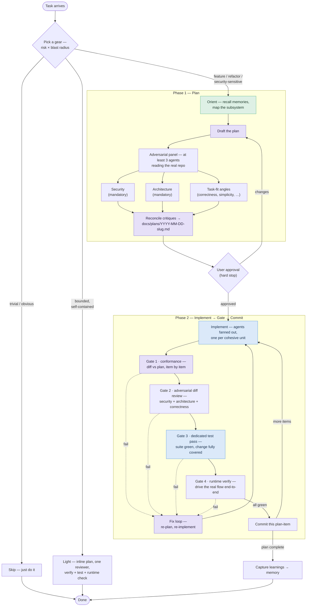

# claude-workflow

[](https://github.com/JulesNsenda/claude-workflow/actions/workflows/ci.yml)

My global [Claude Code](https://claude.com/claude-code) configuration — a small,
curated set of working preferences and skills that I symlink into `~/.claude`.

It's public because the core of it is a **plan-then-implement workflow** and a
**model-routing convention** that I think are good defaults for agentic coding.
Copy what's useful.

## What's in here

| File | What it is |
|---|---|
| [`CLAUDE.md`](./CLAUDE.md) | Always-on rules Claude Code loads every session: the model-tier table, the three gears, and the hard rules. Deliberately small — the procedure lives in the skill below. |
| [`skills/`](./skills/) | On-demand [skills](https://docs.claude.com/en/docs/claude-code/skills). [`plan-gates`](./skills/plan-gates/SKILL.md) is the full plan → gate → commit procedure; [`test`](./skills/test/SKILL.md) enforces the "test everything" pass; [`example-skill`](./skills/example-skill/SKILL.md) is a documented template. |
| [`agents/`](./agents/) | [Subagents](https://docs.claude.com/en/docs/claude-code/sub-agents): the adversarial [`security-critic`](./agents/security-critic.md) and [`architecture-critic`](./agents/architecture-critic.md) (read-oriented tools, findings-only output), an [`implementer`](./agents/implementer.md) that builds strictly from the approved plan (no web/research tools), a [`test-runner`](./agents/test-runner.md) specialist, and an [`Explore`](./agents/explore.md) override pinned to the fast tier (if your Claude Code version doesn't let a user agent shadow the built-in name, set `CLAUDE_CODE_SUBAGENT_MODEL` instead). |
| [`settings.json`](./settings.json) | Permission hygiene: blocks the **Read tool** from secret paths (`.env*`, `secrets/`, `*.pem`/`*.key`, `~/.ssh`, `~/.aws`), denies the common force-push forms, asks before **every** push, allow-lists routine git commands. |
| [`.claude-plugin/`](./.claude-plugin/plugin.json) | Plugin manifest, so the skills + agents can also be installed as a namespaced [plugin](https://docs.claude.com/en/docs/claude-code/plugins). |
| [`install.sh`](./install.sh) / [`install.ps1`](./install.ps1) | Symlink the above into `~/.claude`. Idempotent; backs up anything it would overwrite. |

## The workflow, in one screen

**Orient → Plan → Implement → Review the diff → Test → Verify at runtime →
Commit per item**, with the model tier matched to each phase and the rigor
matched to the risk.

- **Orient first.** Recall project memory and map the affected subsystem with
  cheap fast-tier agents before planning — a wrong mental model poisons
  everything downstream.
- **Adversarial planning.** Draft on the strongest model, then ≥3 parallel
  critics who read the *actual repo*, not just the plan text. **Security and
  architecture are mandatory angles on every plan**; further angles fit the
  task. Reconcile the critiques into a plan file, then **stop for approval**
  before any production code.
- **Implement on mid-tier agents, fanned out** — one per cohesive unit, strictly
  to the plan; deviations get surfaced, not improvised.
- **Gate hard after coding:** plan-conformance check, security + architecture
  review of the *diff* (bugs live in code, not plans), a dedicated test pass
  that must cover every change, and an end-to-end runtime check. Nothing is
  done until it's green, covered, and observed working.
- **Commit per plan-item**, and capture durable lessons to memory at the end.
- **Three gears — skip / light / full** — so rigor scales with risk instead of
  being bypassed.

### As a diagram

Tinted nodes mark the steps where the workflow pins a model tier — **violet =
frontier**, **blue = mid**, **green = fast**; untinted steps inherit from
context.



The authoritative version is split across the documented primitives:
[`CLAUDE.md`](./CLAUDE.md) holds the always-on rules (tier table, gears, hard
rules), the [`plan-gates`](./skills/plan-gates/SKILL.md) skill holds the exact
phases and gates, and the critics live in [`agents/`](./agents/). This summary
is deliberately loose so it drifts as little as possible.

## Effort, and harness assumptions

**Effort is the second axis of the tier table.** Alongside the model tier, each
agent pins an [`effort`](https://platform.claude.com/docs/en/build-with-claude/effort)
level in its frontmatter: frontier agents run `high`, fast/discovery `low`, and
mid-tier agents inherit the session default. `high` *is* the API default, so
pinning the two critics to `high` doesn't make them think harder than a normal
session — it **holds** them at high independent of the session's effort, so a
cheap, low-effort session can't quietly downgrade a security or architecture
review. `xhigh` is reserved for the riskiest full-gear reviews. (This is Claude
Code's subagent `effort:` field — distinct from Claude Managed Agents'
`model.effort`.)

**Harness assumptions — Claude Code ≥ 2.1.218** (version-specific, so stamped):

- **Assumes ≥ 2.1.218**, where `/code-review` — this workflow's Gate 2 — runs as a
  *background subagent*, so reviewing the diff no longer eats the orchestrator's
  context.
- If you **extend** this repo, mind the current subagent defaults: subagents no
  longer spawn nested subagents by default (raise
  `CLAUDE_CODE_MAX_SUBAGENT_SPAWN_DEPTH` to allow deeper nesting); concurrent
  subagents are capped (`CLAUDE_CODE_MAX_CONCURRENT_SUBAGENTS`, default 20); and
  `--max-budget-usd` now halts background subagents once the cap is hit — worth
  setting for unattended runs.
- **This workflow is unaffected by the no-nesting default:** every agent here
  spawns depth-1 from the main session, so nothing here needs
  `CLAUDE_CODE_MAX_SUBAGENT_SPAWN_DEPTH`.

## Install

```bash
git clone https://github.com/JulesNsenda/claude-workflow.git
cd claude-workflow
```

**macOS / Linux:**

```bash
./install.sh            # or: ./install.sh --dry-run  to preview
```

**Windows (PowerShell):**

```powershell
.\install.ps1           # or: .\install.ps1 -DryRun  to preview
```

Then restart Claude Code.

### What the installer does

It creates symlinks so `~/.claude` points back at this repo — edit a file here and
the change is live everywhere immediately, and `git pull` updates your config:

```
~/.claude/CLAUDE.md          ->  <repo>/CLAUDE.md
~/.claude/settings.json      ->  <repo>/settings.json    (unless a real settings.json exists)
~/.claude/agents/<name>.md   ->  <repo>/agents/<name>.md (one link per agent file)
~/.claude/skills/<name>      ->  <repo>/skills/<name>    (one link per skill folder)
```

It is **safe to re-run**. Any existing *real* file at a target is moved to
`<target>.backup.<timestamp>` before the symlink is created; existing symlinks are
replaced in place. **Exception: `settings.json` is never displaced** — an
existing real settings file holds your accumulated permission decisions and
hook wiring, so the installer skips it and tells you to merge the repo's
[`settings.json`](./settings.json) manually — and until you merge it, **none of
the repo's permission rules are active** for you.

### Uninstall

```bash
./install.sh --uninstall      # macOS / Linux
```
```powershell
.\install.ps1 -Uninstall      # Windows
```

Removes the links this repo owns and restores the newest backup of anything the
installer displaced. Links pointing anywhere else are left strictly alone. Both
modes accept the dry-run flag.

> **Windows notes:** `install.sh` deliberately **refuses to run under git-bash /
> MSYS / Cygwin** — `ln -s` there silently *copies* instead of linking, which
> would leave stale files that never receive repo updates. Use `install.ps1`.
> File symlinks need Developer Mode (*Settings → Privacy & security → For
> developers*) or an elevated shell; skill *directories* fall back to a Junction,
> which needs neither — so skills always link cleanly, and only the *file* links
> (`CLAUDE.md`, `settings.json`, `agents/*.md`) require the one-time Developer
> Mode toggle.

### Alternative: install as a plugin

The repo doubles as a Claude Code [plugin](https://docs.claude.com/en/docs/claude-code/plugins)
(`.claude-plugin/plugin.json` at the root; `skills/` and `agents/` are
auto-discovered). A plugin install gets you the skills and agents, namespaced
and conflict-free — but **not** `CLAUDE.md` or `settings.json`: plugins don't
contribute a root `CLAUDE.md` as context, and permission settings stay yours.
The symlink installer remains the full-fidelity path; the plugin is the
low-commitment one. **Pick one path, not both** — installing both registers
every skill and agent twice (once bare, once plugin-namespaced).

## Why no hooks?

Hooks are the right tool for "must happen every time, zero exceptions" — but
they need project-specific commands (there is no universal "run the suite"),
and a *global* Stop hook would fire in every project on every turn. So this
repo ships what *can* be enforced globally: `permissions.deny` rules in
[`settings.json`](./settings.json), which no allow rule can override. Be clear
about their honest limits: they block the **Read tool** from secret paths (a
shell read like `cat .env` instead falls through to a permission prompt), they
deny the *common* force-push spellings (a trailing `--force` falls through to
the push prompt — which is why **every** push asks), and none of it applies
until the settings file is actually linked or merged. Test-gating hooks stay
a per-project addition. Ask
Claude to write one where it fits: *"add a Stop hook that runs `npm test` and
blocks until green."*

## Making your own skill

Copy [`skills/example-skill`](./skills/example-skill/SKILL.md) — it documents the
`SKILL.md` format (kebab-case `name`, a `description` packed with trigger words,
then the procedure body) and how Claude decides when to load a skill.

## Local, private overrides

The bottom of [`CLAUDE.md`](./CLAUDE.md) imports `~/.claude/CLAUDE.local.md` if it
exists (and silently does nothing if it doesn't — verified against Claude Code's
memory loader). Put anything you don't want public — employer conventions,
internal tool/agent names, machine-specific paths — in that file. It lives in
`~/.claude`, never in this repo, so it's impossible to commit by accident.

## Repo hygiene

CI runs `shellcheck` on the shell scripts, PSScriptAnalyzer on the PowerShell
installer, and a **leak guard**: the build fails if any blocklisted private
string lands in the tree. The blocklist itself lives *outside* the repo (as the
`LEAK_BLOCKLIST` GitHub Actions secret — one regex per line) precisely so the
repo never has to name the things it must not contain.

## License

[MIT](./LICENSE) — take it, fork it, adapt it.
