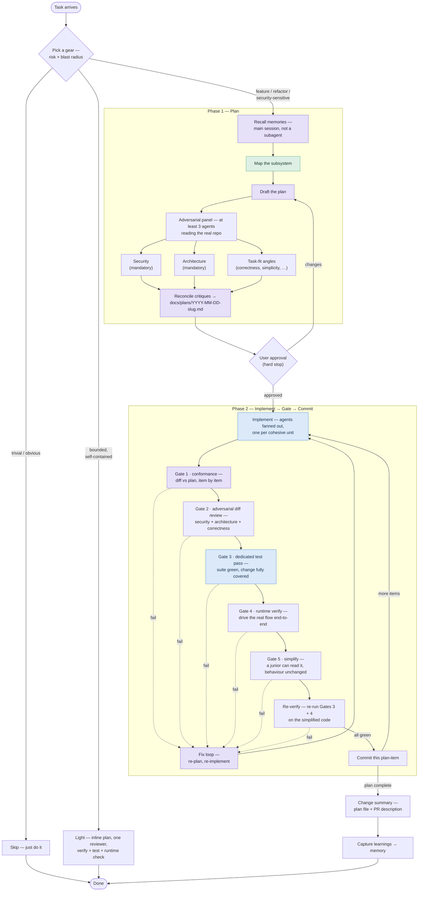

# claude-workflow

[](https://github.com/JulesNsenda/claude-workflow/actions/workflows/ci.yml)

My global [Claude Code](https://claude.com/claude-code) configuration — a small,
curated set of working preferences and skills that I symlink into `~/.claude`.

It's public because the core of it is a **plan-then-implement workflow** and a
**model-routing convention** that I think are good defaults for agentic coding.
Copy what's useful.

## What's in here

| File | What it is |
|---|---|
| [`CLAUDE.md`](./CLAUDE.md) | Always-on rules Claude Code loads every session: the model-tier table, the three gears, and the hard rules. Deliberately small — the procedure lives in the skill below. |
| [`skills/`](./skills/) | On-demand [skills](https://docs.claude.com/en/docs/claude-code/skills). [`plan-gates`](./skills/plan-gates/SKILL.md) is the full plan → gate → commit procedure; [`test`](./skills/test/SKILL.md) enforces the "test everything" pass; [`example-skill`](./skills/example-skill/SKILL.md) is a documented template. |
| [`agents/`](./agents/) | [Subagents](https://docs.claude.com/en/docs/claude-code/sub-agents): the adversarial [`security-critic`](./agents/security-critic.md) and [`architecture-critic`](./agents/architecture-critic.md) (read-oriented tools, findings-only output), an [`implementer`](./agents/implementer.md) that builds strictly from the approved plan (no web/research tools), a [`test-runner`](./agents/test-runner.md) specialist, and an [`Explore`](./agents/explore.md) override pinned to the fast tier. (If your Claude Code version doesn't let a user agent shadow the built-in name, note that the usual workaround — `CLAUDE_CODE_SUBAGENT_MODEL` — is **not** an Explore-only lever: it outranks every subagent's `model:` frontmatter, so it would silently drop the two `opus`-pinned critics onto the fast tier too. Prefer the override file.) |
| [`settings.json`](./settings.json) | Mostly permission hygiene: blocks the **Read tool** from secret paths (`.env*`, `secrets/`, `*.pem`/`*.key`, `~/.ssh`, `~/.aws`), denies the common force-push forms, asks before **every** push, allow-lists routine git commands. Plus one advisory behavioural default — `workflowSizeGuideline: small`, which asks Claude to aim under 5 agents in any *dynamic workflow* it writes. That is a different mechanism from this repo's own subagents, which it does not touch — and it is advice, not a cap. Setting it from a settings file needs ≥ 2.1.219 (`/config` has offered it since 2.1.202). If you merge this file by hand, merge the `permissions` block first and independently: it is the part that is load-bearing. And note the direction the installer's symlink runs — once linked, upstream changes to this file land in your live config on `git pull`, so `cp -L` it to a real file if you want to gate that. |
| [`.claude-plugin/`](./.claude-plugin/plugin.json) | Plugin manifest, so the skills + agents can also be installed as a namespaced [plugin](https://docs.claude.com/en/docs/claude-code/plugins). |
| [`scripts/`](./scripts/) | The leak guard, [`run-stats.sh`](./scripts/run-stats.sh) (the run-stats aggregator), [`ref-check.sh`](./scripts/ref-check.sh), which asserts the docs and the `agents/`+`skills/` tree still name each other correctly, and [`version-check.sh`](./scripts/version-check.sh), which asserts a release tag matches the plugin manifest. **Not** symlinked by the installer — run these from the clone. |
| [`install.sh`](./install.sh) / [`install.ps1`](./install.ps1) | Symlink the above into `~/.claude`. Idempotent; backs up anything it would overwrite. |
| [`CHANGELOG.md`](./CHANGELOG.md) | What changed per release, and what major/minor/patch mean for a config repo. Tags track the version in the plugin manifest — pin a clone with `git checkout v1.1.0` if you don't want `main` to move under you. |
| [`.claude/CLAUDE.md`](./.claude/CLAUDE.md) | Guidance for working **on this repo** — commands, the layering rules, and the CI invariants that prose edits break. The only tracked file under `.claude/`, and the counterpart to the row at the top of this table: that `CLAUDE.md` is the shipped product and loads everywhere, this one is project memory here and ships to nobody's `~/.claude`. Not installed, not in the reference checker's corpus. |

## The workflow, in one screen

**Orient → Plan → Implement → Review the diff → Test → Verify at runtime →
Commit per item**, with the model tier matched to each phase and the rigor
matched to the risk.

- **Orient first.** Recall project memory in the main session — subagents don't
  inherit it — then map the affected subsystem with cheap fast-tier agents,
  before planning: a wrong mental model poisons everything downstream.
- **Adversarial planning.** Draft on the strongest model, then ≥3 parallel
  critics who read the *actual repo*, not just the plan text. **Security and
  architecture are mandatory angles on every plan**; further angles fit the
  task. Reconcile the critiques into a plan file, then **stop for approval**
  before any production code.
- **Implement on mid-tier agents, fanned out** — one per cohesive unit, strictly
  to the plan; deviations get surfaced, not improvised.
- **Gate hard after coding:** plan-conformance check, security + architecture
  review of the *diff* (bugs live in code, not plans), a dedicated test pass
  that must cover every change, and an end-to-end runtime check. Nothing is
  done until it's green, covered, and observed working.
- **Commit per plan-item**, then a plain-language change summary for the PR
  and durable lessons to memory at the end.
- **Three gears — skip / light / full** — so rigor scales with risk instead of
  being bypassed.

### As a diagram

Tinted nodes mark the steps where the workflow pins a model tier — **violet =
frontier**, **blue = mid**, **green = fast**; untinted steps inherit from
context.


```mermaid
flowchart TD
    Task([Task arrives]) --> Gear{"Pick a gear —<br/>risk × blast radius"}
    Gear -->|"trivial / obvious"| Skip["Skip — just do it"]
    Gear -->|"bounded,<br/>self-contained"| Light["Light — inline plan, one reviewer,<br/>verify + test + runtime check"]
    Gear -->|"feature / refactor /<br/>security-sensitive"| Orient

    subgraph P1["Phase 1 — Plan"]
        Orient["Recall memories —<br/>main session, not a subagent"]:::frontier --> Map["Map the subsystem"]:::fast
        Map --> Draft["Draft the plan"]:::frontier
        Draft --> Panel["Adversarial panel — at least 3 agents<br/>reading the real repo"]
        Panel --> Sec["Security<br/>(mandatory)"]
        Panel --> Arch["Architecture<br/>(mandatory)"]
        Panel --> Fit["Task-fit angles<br/>(correctness, simplicity, …)"]
        Sec --> Reconcile["Reconcile critiques →<br/>docs/plans/YYYY-MM-DD-slug.md"]:::frontier
        Arch --> Reconcile
        Fit --> Reconcile
    end

    Reconcile --> Approve{"User approval<br/>(hard stop)"}
    Approve -->|"changes"| Draft
    Approve -->|"approved"| Impl

    subgraph P2["Phase 2 — Implement → Gate → Commit"]
        Impl["Implement — agents fanned out,<br/>one per cohesive unit"]:::mid --> G1
        G1["Gate 1 · conformance —<br/>diff vs plan, item by item"]:::frontier --> G2
        G2["Gate 2 · adversarial diff review —<br/>security + architecture + correctness"] --> G3
        G3["Gate 3 · dedicated test pass —<br/>suite green, change fully covered"]:::mid --> G4
        G4["Gate 4 · runtime verify —<br/>drive the real flow end-to-end"] --> G5
        G5["Gate 5 · simplify —<br/>a junior can read it, behaviour unchanged"] --> ReV
        ReV["Re-verify — re-run Gates 3 + 4<br/>on the simplified code"]
        Fix["Fix loop —<br/>re-plan, re-implement"]:::frontier
        G1 -. "fail" .-> Fix
        G2 -. "fail" .-> Fix
        G3 -. "fail" .-> Fix
        G4 -. "fail" .-> Fix
        G5 -. "fail" .-> Fix
        ReV -. "fail" .-> Fix
        Fix --> Impl
        ReV -->|"all green"| Commit["Commit this plan-item"]
        Commit -->|"more items"| Impl
    end

    Commit -->|"plan complete"| Summary["Change summary —<br/>plan file + PR description"]
    Summary --> Capture["Capture learnings → memory"]
    Skip --> Done([Done])
    Light --> Done
    Capture --> Done

    classDef frontier fill:#e6e0f8,stroke:#7c6bd6,color:#2a2340
    classDef mid fill:#dbe9f9,stroke:#4a90d9,color:#1c3350
    classDef fast fill:#def0e5,stroke:#4caf7d,color:#1d3a2a
```

The authoritative version is split across the documented primitives:
[`CLAUDE.md`](./CLAUDE.md) holds the always-on rules (tier table, gears, hard
rules), the [`plan-gates`](./skills/plan-gates/SKILL.md) skill holds the exact
phases and gates, and the critics live in [`agents/`](./agents/). This summary
is deliberately loose so it drifts as little as possible.

## Assumptions, and the knobs behind them

**Effort is the second axis of the tier table.** Alongside the model tier, each
agent pins an [`effort`](https://platform.claude.com/docs/en/build-with-claude/effort)
level in its frontmatter: frontier agents run `high` and mid-tier agents inherit
the session default. (The fast/discovery tier's intended level is `low`, but its
current model, Haiku, doesn't take an effort level — so that tier isn't pinned
today; the intent applies if it moves to an effort-capable model.) `high` *is* the
API default, so
pinning the two critics to `high` doesn't make them think harder than a normal
session — it **holds** them at high independent of the session's effort, so a
cheap, low-effort session can't quietly downgrade a security or architecture
review. Two documented exceptions to that hold: `CLAUDE_CODE_EFFORT_LEVEL` in
the environment overrides frontmatter, and Enterprise per-model effort caps
clamp it. (This is Claude Code's subagent `effort:` field — distinct from Claude
Managed Agents' `model.effort`.)

**`xhigh` is a session lever, not a pin** — and so is Ultracode, which as of
2.1.284 is a separate toggle in `/effort` rather than a level above `xhigh`
(see the harness assumptions below). No agent here pins either, and there is
no per-invocation effort override **at the point of spawning** — the Agent tool
takes a `model` parameter, but there is no `effort` equivalent. So `/effort
xhigh` before a high-risk review escalates the orchestrator and any *un-pinned*
agent, and leaves the two `high`-pinned critics exactly where they were.
Risk-tiering therefore works by **adding an angle rather than adding effort**:
for a diff touching auth, payments, or data, Gate 2 spawns an extra task-fit
critic.

Scope that claim carefully: it is about **the Agent tool**, which is still the
mechanism with no effort parameter. A **skill** is a different story — skill
frontmatter carries its own effort and model fields, and the effort one
**overrides** the session level while the skill is active.

That lever exists, and `plan-gates` deliberately does **not** use it. Pinning
`high` there looks like it would hold the orchestrator the way the critics'
pins hold the reviewers, but a skill-level effort field overrides rather than
floors: on a session escalated to `xhigh` it would clamp the entire full-gear
procedure *down* to `high`, silently, at exactly the moment someone paid to
escalate. That is the same argument rejected two paragraphs down for a `medium`
pin on the security gate, and it is rejected here for the same reason. The
protection it would buy — a cheap session can't plan at low effort — is not
worth breaking the escalation path the paragraph above promises.

That also settles the two-pass question. The prompting guide notes review
accuracy holds at lower effort, "which supports a fast pass at review time and
a more thorough pass later" — but implementing that literally would mean a
`medium` pin on a mandatory security gate, which on an `xhigh` session pins it
*below* what it gets today. Here the plan pass gets a narrower brief and the
diff pass the full one, with effort pinned at `high` throughout.

### Nesting: the agents this repo defines can't spawn

**No agent defined here is granted a spawn tool.** Every `tools:` list in
[`agents/`](./agents/) is an allowlist, and none of them includes `Agent` — so
whatever the platform default is, these agents can't nest through the harness.
(`Bash` remains a general escape hatch; a depth cap is not a sandbox, and the
`permissions.deny` rules below constrain the **Read tool**, not shell reads.)
The uncontrolled edges are the built-ins this repo doesn't define: the
`general-purpose` task-fit critics the plan-gates panel spawns, and
`/code-review` at Gate 2. Omitting `Agent` from `tools:` only works for agents
you define; for the built-ins the levers are `disallowedTools` and the guard
below.

The **platform default is 3 — and still not something to rely on**. The docs
and CHANGELOG now agree: the v2.1.219 CHANGELOG moved the default from 1 to 3,
and the sub-agents reference, which used to say a subagent can't spawn by
default, now says "3 layers deep by default". (Earlier the two disagreed;
resolved as of 2.1.284.) But the 2.1.284 build reads the default from a
remotely served flag (`maxSubagentSpawnDepthFromGrowthBook`), so it can move
without a release you'd notice. The env var is the documented override (the
build's own refusal message says to raise it); its precedence over the remote
flag was not separately tested. Set it explicitly if
you depend on the depth:

```jsonc
{
  "permissions": { /* … keep yours … */ },
  "env": { "CLAUDE_CODE_MAX_SUBAGENT_SPAWN_DEPTH": "1" }
}
```

`"1"` means one layer below the main conversation — subagents that cannot
delegate further; verify that reading against your installed version. **Merge
this into your settings, don't paste over them** — the `permissions` block has
to survive. And check `ls -l ~/.claude/settings.json` first: on a fresh install
it is a *symlink into this repo*, so editing it in place would put your personal
environment into a tracked, public file. Replace it with a real copy (`cp -L`)
before adding anything machine-specific.

### Harness assumptions — Claude Code ≥ 2.1.218, re-checked against 2.1.284

Version-specific, so stamped — everything in this subsection rots on a
platform schedule:

- **Assumes ≥ 2.1.218**, where `/code-review` — this workflow's Gate 2 — runs as a
  *background subagent*, so reviewing the diff no longer eats the orchestrator's
  context. **Re-check against 2.1.232**, which narrowed that to *at high
  effort*: below high it is back in the orchestrator's context. And since
  2.1.223 a bare call reuses the level typed last, so the level is not a
  stylistic choice — `plan-gates` names `high` at Gate 2 for both reasons.
  (The current code-review page describes backgrounding without the
  high-effort qualifier; unresolved, and moot here because Gate 2 names
  `high` either way.)
- Concurrent subagents are capped (`CLAUDE_CODE_MAX_CONCURRENT_SUBAGENTS`,
  default 20), and `--max-budget-usd` halts background subagents once the
  budget is hit — worth setting for unattended runs. Both names are present in
  the 2.1.284 build; neither appears in the current docs, so the default of 20
  was not re-confirmed.
- **Gate 4 names a project `verify` skill, else `/run`** — there is no built-in
  `/verify`. No bundled skill registers `verify`
  in 2.1.284; the harness looks for a *project* skill at
  `.claude/skills/verify/SKILL.md` and otherwise points at the built-in that
  launches and drives the app.
- **Ultracode is its own toggle** — `/effort ultracode on|off`, separate from
  the effort level. It is what brings dynamic workflows (the multi-agent
  Workflow tool) into play, which is the thing `workflowSizeGuideline` in
  [`settings.json`](./settings.json) advises on. `plan-gates` Phase 2
  deliberately stays on plain `Agent` fan-out: its implementers, critics and
  gates are a fixed, reviewable sequence, and a workflow script would put the
  orchestration outside the plan file the approval stop was given.

### Model assumptions — Fable 5.1 / Opus 5.5 era, checked against Claude Code 2.1.284

Three facts that decide how to read the tier table, then cost context and what
was watched but not adopted (those two carry no version stamp):

- **The critics pin `opus`, which is not the same as "strongest available".**
  `best` resolves to Fable (5.1 today, which needs ≥ 2.1.257) where your
  organization has access to it, *otherwise the latest Opus* (5.5 today) — so
  on an org with Fable, `best` and `opus` diverge and these agents run the
  Opus. That is a deliberate cost choice, not
  an oversight; switch the two `model:` pins to `best` if you'd rather have the
  ceiling. Watch one edge: `opus` resolves by **provider**, and on Microsoft
  Foundry it lands on Opus 4.6. Separately, the **`default` setting** varies by
  **account type** — a different axis from the alias, and easy to conflate. A
  copy of that table used to live here (Sonnet 5 on Pro, Team Standard and
  Enterprise seats) and went stale with the 5.5 lineup, which is why it no
  longer does. See the
  [model-config docs](https://code.claude.com/docs/en/model-config) for both
  tables rather than trusting a copy here.
- **A report line naming a previous Opus is expected, not a routing bug.**
  The frontier models run cybersecurity and biology safety classifiers. A
  cybersecurity-flagged request re-runs on an older model — per the
  CHANGELOG, Fable and Opus 5.5 step down through Opus 5 to Opus 4.8, and
  Sonnet 5.5 to Sonnet 5 — and a biology-flagged one refuses outright with no
  fallback. Don't confuse that chain with the per-model `fallback_3p` table in
  the build (Fable 5.1 → Fable 5 → Opus 5.5 → Opus 5, checked in 2.1.284):
  that one is third-party-provider *availability* fallback, a different
  mechanism, and does not corroborate the classifier chain. Critically, **the session then continues
  on the fallback model until you run `/model`** — so a security review that
  trips the classifier can leave the rest of the session downgraded, which is
  exactly why every agent report opens with a `model:` line. Under an
  `availableModels` allowlist that excludes the fallback target the request
  ends in a refusal instead, leaving the session's model unchanged — a
  different failure mode with the same cause. Turning the automatic switch off
  in `/config` makes a flagged request pause and ask instead. `claude
  --safe-mode` tells you whether **your customizations** are the trigger — it
  disables CLAUDE.md, skills, MCP servers, hooks *and this repo's agents*,
  while git status and directory names still load, so it does not rule out the
  repository's own content.
- **Effort carries over between models.** Opus 5.x does *not* reset to its own
  default when you switch to it — a level you previously set carries over, and
  `low`/`medium`/`high`/`xhigh` persist across sessions once set interactively
  (`max` is session-only). So the tier table's pins are the source of truth,
  and an effort level set for one experiment outlives it.

On cost (recorded for Opus 5; not re-checked for 5.5): Opus 5 is not a step up from the previous frontier Opus — same
per-token price, with a 1M-token context window as both its default and its
maximum. In Claude Code that window is included on Max, Team and Enterprise and
needs usage credits on Pro. Fast mode runs it up to 2.5× faster, billed to
usage credits on subscription plans. Current numbers live on the
[pricing page](https://claude.com/pricing); this repo deliberately carries none.

**Watched, not adopted.** The Messages API's *mid-conversation tool changes*
and *server-side fallback* betas are both platform-side request features, with
nothing for a Claude Code configuration repo to adopt yet. Both are distinct
from the classifier fallback described above and from Claude Code's
`--fallback-model` chains, which are live and not beta. Noted so the next
person reading the Opus 5 release notes can see they were considered.

## Measuring the workflow

Every full-gear run seeds a short `## Run stats` block into its plan file when
the plan is written, then keeps it as a running ledger — each key is filled at
the checkpoint its *Filled at* column names and the block is closed before the
change summary. It holds findings actioned, rejected and dropped at each critic
pass, defects that escaped both passes, agents spawned, and which gates needed
a fix loop (`gates_failed`, a list such as `2,4`, tallied per gate; the older
`gates_failed_first_pass` count still parses and shows as `n=2`).
[`scripts/run-stats.sh`](./scripts/run-stats.sh) aggregates those blocks; the
format is [`scripts/run-stats.example.md`](./scripts/run-stats.example.md). A
key holding `pending` (not reached yet) lists the run as still pending and keeps
it out of the ratios, whereas `unknown` (not knowable) is written rather than
guessed. The parser also lists unfilled sections, malformed blocks and
still-pending runs by `file:line`. It takes any number of directories, so the
corpus can span projects rather than being capped at one repo's runs:

```bash
scripts/run-stats.sh ~/code/*/docs/plans
```

The point is to stop describing this workflow with adjectives. What the schema
actually answers is **critic yield**: how much gets caught at plan stage versus
diff stage versus escaping both passes. Two other questions worth asking — are
the gear thresholds right, and where does the token budget go — are *not*
instrumented: there is no cost or duration key, and the block is only written by
the full-gear procedure, so lighter runs leave no row (`escalated_from` is the
only trace one ever existed).

**What these numbers can and can't support.** This is a sample of one person's
tasks, scored by the same person who chose the workflow — not a benchmark. It
can support claims about *this* workflow on *this* kind of work, and nothing
comparative: it cannot tell you this setup beats another one, because there is
no control. Rejected findings are a signal, not a failure — they measure critic
noise, which is exactly what you want to watch after telling the critics to stop
filtering themselves. And the instrument can't see its own miscalibration: a
ratio computed wrongly, or a key nobody ever fills, looks identical to a healthy
run. Treat a suspiciously clean column as a reason to check the script, not as a
result. Every figure is also **self-reported by the actor being graded** — the
same session decides what to reject and then writes the rejection count — so
under-reporting is undetectable by construction.

Plan files land in the worked-on project's `docs/plans/`. *This* repo gitignores
`/docs/`; most projects don't, so add it to that project's `.gitignore` before
writing a plan file there — those files record which findings you consciously
rejected, which is not something to push to a shared remote by accident.

## Memory: the built-in mechanism

Everything in this paragraph is a harness fact, checked against Claude Code
2.1.220 — it rots on a platform schedule, like the assumptions above.
Claude Code ships a built-in **auto memory** mechanism, on by default
(`autoMemoryEnabled`, default `true`) — this workflow builds on it rather than
inventing a parallel one. It writes to `~/.claude/projects/<project>/memory/`:
a `MEMORY.md` index plus topic files. The `<project>` path is derived from the
git repository, so all worktrees and subdirectories within the same repo
share one auto memory directory. Only the first 200 lines of `MEMORY.md`, or
the first 25KB, whichever comes first, load at session start; topic files
load on demand. So `MEMORY.md` has to stay an index — one line per entry —
with detail pushed out into topic files, or the load budget burns on the
index itself. Auto memory is also machine-local: files aren't shared across
machines or cloud environments. And it sits outside any repo tree **by
default** — under `~/.claude/`, not this one — though `autoMemoryDirectory`
can relocate it from any settings scope (project scope only after the
workspace trust dialog). Pointing that knob into a repo tree is the one easy
way to put private notes under version control, so don't; if you must,
gitignore the target first.

**The entry format is three fields, nothing longer:** **decision**, **why**
(the reasoning that would otherwise be lost), and **the trap it avoids** (what
goes wrong for someone who doesn't know this). That's the required **body
content of an auto-memory file**, not a competing file format — the harness
already writes these files with YAML frontmatter, and a rival format here
would be exactly the drift this section exists to prevent.

**The most valuable fact about the mechanism is a constraint, not a feature:**
the main conversation's auto memory isn't loaded into subagents — the one
exception is a fork. So recall is a **main-session action** — the `Explore`
subagent that maps the codebase cannot do it for you. That's why
[`plan-gates`](./skills/plan-gates/SKILL.md)'s *orient* step recalls *before*
it hands the codebase map to `Explore`, rather than folding the two together:
the order is load-bearing, not incidental.

**Privacy split.** Project- or employer-specific material belongs on the
`~/.claude/CLAUDE.local.md` side of that boundary, never in a tracked tree —
public or client-private. Worth naming explicitly: a subagent's `memory:`
frontmatter field with scope `project` writes to `.claude/agent-memory/<agent>/`
— *inside* the repo. This workflow doesn't use that field. If you ever enable
it, add `/.claude/` to that project's `.gitignore` first, the same way you'd
add `/docs/` before writing a plan file there.

What's actually worth writing down, and what isn't, lives in exactly one
place — the *Capture what you learned* step of
[`plan-gates`](./skills/plan-gates/SKILL.md) — rather than restated here, the
same way "Measuring the workflow" above points at
`scripts/run-stats.example.md` instead of duplicating its key list.

## Install

```bash
git clone https://github.com/JulesNsenda/claude-workflow.git
cd claude-workflow
```

**macOS / Linux:**

```bash
./install.sh            # or: ./install.sh --dry-run  to preview
```

**Windows (PowerShell):**

```powershell
.\install.ps1           # or: .\install.ps1 -DryRun  to preview
```

Then restart Claude Code.

### What the installer does

It creates symlinks so `~/.claude` points back at this repo — edit a file here and
the change is live everywhere immediately, and `git pull` updates your config:

```
~/.claude/CLAUDE.md          ->  <repo>/CLAUDE.md
~/.claude/settings.json      ->  <repo>/settings.json    (unless a real settings.json exists)
~/.claude/agents/<name>.md   ->  <repo>/agents/<name>.md (one link per agent file)
~/.claude/skills/<name>      ->  <repo>/skills/<name>    (one link per skill folder)
```

It is **safe to re-run**. Any existing *real* file at a target is moved to
`<target>.backup.<timestamp>` before the symlink is created; existing symlinks are
replaced in place. **Exception: `settings.json` is never displaced** — an
existing real settings file holds your accumulated permission decisions and
hook wiring, so the installer skips it and tells you to merge the repo's
[`settings.json`](./settings.json) manually — and until you merge it, **none of
the repo's permission rules are active** for you. A `settings.json` that is a
symlink pointing somewhere else (say, into a dotfiles repo) gets the same
treatment: it is left alone, not re-pointed at this repo. "Is this link
mine?" is decided by file identity (`-ef` in the shell, the resolved path in
PowerShell), not by comparing the link text, so a relative link to this repo's
`settings.json` is recognised as yours and left as is. A **dangling** symlink
(its target is gone, or only unmounted for now) holds no data, so it is
re-linked to the repo — but the link itself is first kept as
`settings.json.backup.<timestamp>`, so the old pointer stays restorable.

To make the merge less of a guess, the installer then runs a **drift report**
and prints every setting the repo has that yours lacks or differs on, e.g.
`settings drift: missing ["permissions","deny"] "Read(.env)"`. It prints paths and the
repo's values only — never a value from your file. Drift arrives with a
`git pull`, not just at install time, so re-run the report afterwards:

```bash
sh scripts/settings-drift.sh settings.json ~/.claude/settings.json
```
```powershell
powershell -NoProfile -ExecutionPolicy Bypass -File .\scripts\settings-drift.ps1 -Repo .\settings.json -Live $env:USERPROFILE\.claude\settings.json
```

The installers print this command for you at the end of the report (`sh` plus
shell-quoted paths; on Windows the current PowerShell host with
`-NoProfile -ExecutionPolicy Bypass -File` and single-quoted paths), so it
pastes as it stands.

The shell version needs `jq`; without it, it says `settings drift: not checked - jq
not found` and changes nothing (the PowerShell version has no dependencies). The
report is **one-directional**: it sees what the repo adds, not what it later
removes, so a rule dropped from the repo's `settings.json` stays in your merged
file until you delete it — the CHANGELOG lists such removals.

### Uninstall

```bash
./install.sh --uninstall      # macOS / Linux
```
```powershell
.\install.ps1 -Uninstall      # Windows
```

Removes the links this repo owns and restores the newest backup of anything the
installer displaced. Links pointing anywhere else are left strictly alone. Both
modes accept the dry-run flag.

> **Windows notes:** `install.sh` deliberately **refuses to run under git-bash /
> MSYS / Cygwin** — `ln -s` there silently *copies* instead of linking, which
> would leave stale files that never receive repo updates. Use `install.ps1`.
> File symlinks need Developer Mode (*Settings → Privacy & security → For
> developers*) or an elevated shell; skill *directories* fall back to a Junction,
> which needs neither — so skills always link cleanly, and only the *file* links
> (`CLAUDE.md`, `settings.json`, `agents/*.md`) require the one-time Developer
> Mode toggle.

### Alternative: install as a plugin

The repo doubles as a Claude Code [plugin](https://docs.claude.com/en/docs/claude-code/plugins)
(`.claude-plugin/plugin.json` at the root; `skills/` and `agents/` are
auto-discovered). A plugin install gets you the skills and agents, namespaced
and conflict-free — but **not** `CLAUDE.md` or `settings.json`: plugins don't
contribute a root `CLAUDE.md` as context, and permission settings stay yours.
The symlink installer remains the full-fidelity path; the plugin is the
low-commitment one. **Pick one path, not both** — installing both registers
every skill and agent twice (once bare, once plugin-namespaced).

## Why no hooks?

Hooks are the right tool for "must happen every time, zero exceptions" — but
they need project-specific commands (there is no universal "run the suite"),
and a *global* Stop hook would fire in every project on every turn. So this
repo ships what *can* be enforced globally: `permissions.deny` rules in
[`settings.json`](./settings.json), which no allow rule can override. Be clear
about their honest limits: they block the **Read tool** from secret paths (a
shell read like `cat .env` instead falls through to a permission prompt), they
deny the *common* force-push spellings (a trailing `--force` falls through to
the push prompt — which is why **every** push asks), and none of it applies
until the settings file is actually linked or merged. Test-gating hooks stay
a per-project addition. Ask
Claude to write one where it fits: *"add a Stop hook that runs `npm test` and
blocks until green."*

A related question: could `sandbox.network.strictAllowlist` — "deny
non-allowlisted hosts for sandboxed commands without prompting," per the
v2.1.219 CHANGELOG (its only description anywhere checked; it's absent from
the settings reference's sandbox table, 30 keys checked, and from the
sandboxing page) — enforce [`implementer`](./agents/implementer.md)'s "no
web/research tools" constraint instead of leaving half of it
instruction-held? No, for two decisive reasons. It can't target one agent:
subagents "run in the same process as the parent session and use the same
sandbox configuration," and no subagent frontmatter field names a sandbox
or a network scope — the setting is session-wide or nothing, which would
also gate the main session's `git fetch`/`gh` and `test-runner`'s
`npm install`/`mvn`. And it's inert where this repo is maintained: the
sandbox "runs on macOS, Linux, and WSL2" — not native Windows — and
`failIfUnavailable` defaults to `false`, so on that platform it would warn
and run unsandboxed. A rule that looks enforced and isn't is worse than the
honest limit stated here.

The constraint isn't purely instruction-held to begin with: `implementer`'s
`tools:` allowlist (`Read, Edit, Write, Bash, Grep, Glob`) already denies
`WebFetch`/`WebSearch` deterministically, no sandbox involved. Only the
Bash-shelled half — `curl`, `wget`, `npm install`, `gh` — rests on the
prompt. Two deterministic levers exist for that half too, and both are
declined rather than absent: a `permissions.deny` rule such as
`Bash(curl:*)` / `Bash(wget:*)`, and a per-subagent `hooks:` field. Declined
because the first is session-wide like `strictAllowlist`, and either would
change what the workflow does, not just how this one constraint is held. The
obvious third candidate isn't one: `disallowedTools` *is* per-subagent, but it
takes tool names (and MCP server patterns), not permission-rule syntax — it can
deny `Bash` outright, which would take the implementer's build and test
capability with it, and it cannot express "Bash, but no egress."
Nothing here goes into `settings.json`.

## Making your own skill

Copy [`skills/example-skill`](./skills/example-skill/SKILL.md) — it documents the
`SKILL.md` format (kebab-case `name`, a `description` packed with trigger words,
then the procedure body) and how Claude decides when to load a skill.

## Local, private overrides

The bottom of [`CLAUDE.md`](./CLAUDE.md) imports `~/.claude/CLAUDE.local.md` if it
exists (and silently does nothing if it doesn't — verified against Claude Code's
memory loader). Put anything you don't want public — employer conventions,
internal tool/agent names, machine-specific paths — in that file. It lives in
`~/.claude`, never in this repo, so it's impossible to commit by accident.

**One setting can switch all of this off.** Claude Code now also reads
`AGENTS.md` (checked against 2.1.284), and a project-instructions setting
decides which instruction files load: `claude-md-or-agents-md` (the default —
a project with no `CLAUDE.md` gets its `AGENTS.md` instead), `claude-md`,
`claude-md-and-agents-md`, and `managed-only`. The first three leave this
repo's global `CLAUDE.md` alone. **`managed-only` does not**: in the build's
own words, "the project's and your own instruction files are dropped; the
organization's managed CLAUDE.md and memory stay" — so under it the tier
table, the gears and the hard rules silently stop loading, while the skills
and agents still install. If the rules seem to have gone quiet on a managed
machine, check that setting first.

## Repo hygiene

CI runs `shellcheck` on the shell scripts, PSScriptAnalyzer on the PowerShell
installer and the PowerShell drift script, two **settings-drift** jobs (the
fixtures in [`scripts/settings-drift-fixtures/`](./scripts/settings-drift-fixtures/README.md)
run through `settings-drift.sh` on Linux and `settings-drift.ps1` under Windows
PowerShell 5.1 and PowerShell 7, plus the installers run against a scratch home
to check the drift report, the symlink cases and that a dry run writes nothing),
a **smoke test** that parses
[`scripts/run-stats.example.md`](./scripts/run-stats.example.md) with
`run-stats.sh` — so the format doc and the parser can't drift apart silently —
a **reference check** ([`ref-check.sh`](./scripts/ref-check.sh)) that fails the
build when the docs and the agent/skill tree stop agreeing — a renamed or
deleted agent leaves either a dangling mention or a definition nothing points
at, and neither used to fail anything — and a **leak guard**: the build fails if
any blocklisted private string lands in the tree, or if any tracked Markdown
file is not valid UTF-8. The blocklist itself lives *outside* the repo (as the
`LEAK_BLOCKLIST` GitHub Actions secret — one regex per line) precisely so the
repo never has to name the things it must not contain.

The reference check gets its own guard, because a checker that quietly matches
nothing exits 0 forever and reads as green. Its CI job carries one deliberately
broken fixture per check, and asserts the *message* each one produces rather
than just a non-zero exit — asserting the exit code alone was measured to let
three of the four checks be deleted with the job still passing. The same
measurement killed an earlier CRLF fixture that turned out to be tautological.

## Releases

Two things carry the version that a *consumer* reads — the git tag a clone pins
with `git checkout v1.0.0`, and the `version` field in the plugin manifest a
plugin install reads. [`version-check.sh`](./scripts/version-check.sh) asserts
they agree, and CI runs it on tag pushes. So the order is **push the tag, wait
for CI, then create the release**: the check is deliberately detective rather
than preventive, and a tag that nothing has consumed yet is cheap to delete and
re-cut. What it exists to prevent is the two disagreeing *silently*.

`CHANGELOG.md` is a third carrier and is **not** guarded — cutting a tag whose
version has no matching changelog heading still passes. That leg stays a human
check for now.

The workflow triggers on `*`, not `v*`, on purpose. The trigger filter is the
real gate on which tags get checked, so a `v*` filter would mean `git tag 1.1.0`
runs no CI at all — the guard silently absent at exactly the moment it exists
for. Matching every tag lets the script's own shape check reject a non-`v` tag
loudly instead.

It carries the same self-guard as the reference check — a fixture per failure
mode, asserting the message rather than the exit status — and those fixtures run
on every push, not only on tags, so the script can't sit unexercised between
releases and first prove itself broken at the one moment it matters. Two of them
aren't about the script at all. One covers a wiring mistake in the CI file:
`github.ref` is `refs/tags/v1.0.0` while `github.ref_name` is `v1.0.0`, and
passing the former would fail every release forever without a bare-tag fixture
ever noticing. Another runs the script against the *real* manifest on every
push — otherwise the default-manifest path, which is the only path a release
uses, would first be exercised at tag time.

One guard has no fixture and can't have one: the multi-line-value refusal is
unreachable while the key-count floor above it stands, and is verified by
mutation instead. That floor counts *occurrences*, not matching lines, because
counting lines inverted the whole check on a single-line manifest — `v9.9.9`
passed clean against a manifest whose real version was `1.2.3`. The regression
fixture asserts both directions.

What the version numbers themselves mean — and why "breaking" is read against
the installed surface rather than an API — is in
[`CHANGELOG.md`](./CHANGELOG.md).

## License

[MIT](./LICENSE) — take it, fork it, adapt it.
